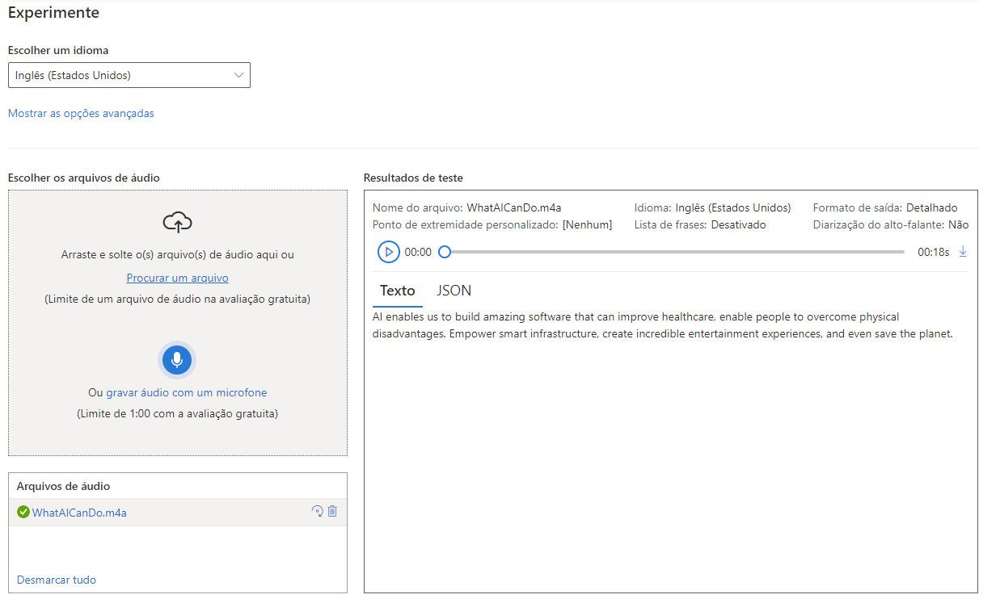
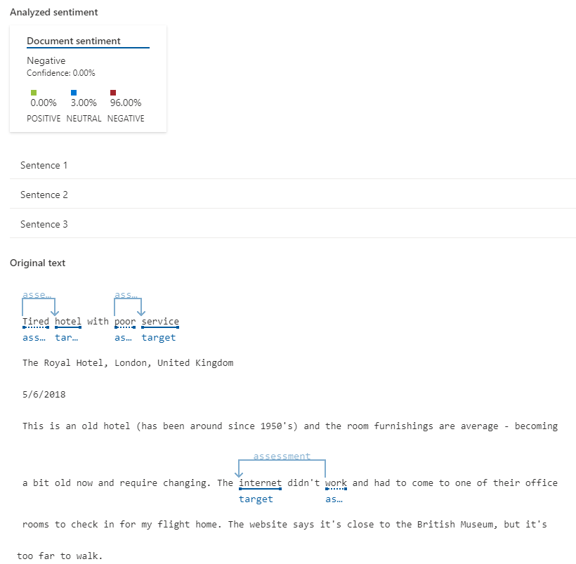
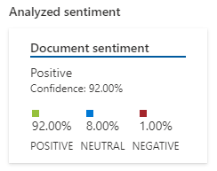
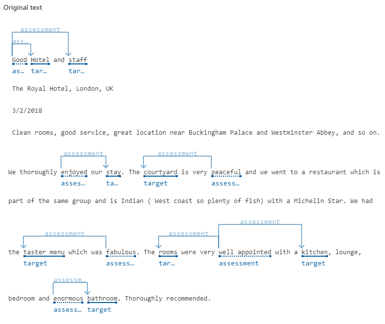
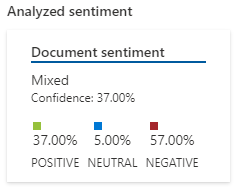
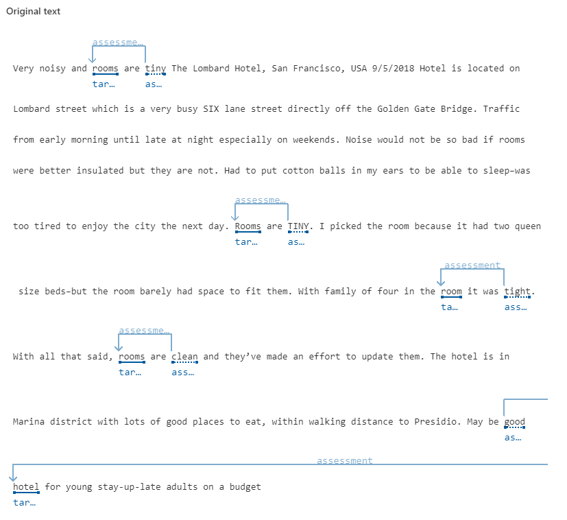

# Análise de Sentimentos com Language Studio no Azure AI

## Explore a fala para texto no Speech Studio

### Input:

- Arquivo _**WhatCanIDo.m4a**_ baixado do link https://aka.ms/mslearn-speech-files e extraído da pasta _**speech.zip**_;

### Output:

#### Printscreen:



#### JSON:

```.json
[
    {
        "Id": "8975e76bf724463cbca1c43e11da873c",
        "RecognitionStatus": 0,
        "Offset": 12800000,
        "Duration": 67600000,
        "Channel": 0,
        "DisplayText": "AI enables us to build amazing software that can improve healthcare, enable people to overcome physical disadvantages.",
        "NBest": [
            {
                "Confidence": 0.88912195,
                "Lexical": "AI enables us to build amazing software that can improve healthcare enable people to overcome physical disadvantages",
                "ITN": "AI enables us to build amazing software that can improve healthcare enable people to overcome physical disadvantages",
                "MaskedITN": "ai enables us to build amazing software that can improve healthcare enable people to overcome physical disadvantages",
                "Display": "AI enables us to build amazing software that can improve healthcare, enable people to overcome physical disadvantages.",
                "Words": [
                    {
                        "Word": "AI",
                        "Offset": 12800000,
                        "Duration": 800000
                    },
                    {
                        "Word": "enables",
                        "Offset": 13600000,
                        "Duration": 6800000
                    },
                    {
                        "Word": "us",
                        "Offset": 20400000,
                        "Duration": 1200000
                    },
                    {
                        "Word": "to",
                        "Offset": 21600000,
                        "Duration": 1200000
                    },
                    {
                        "Word": "build",
                        "Offset": 22800000,
                        "Duration": 3200000
                    },
                    {
                        "Word": "amazing",
                        "Offset": 26000000,
                        "Duration": 6000000
                    },
                    {
                        "Word": "software",
                        "Offset": 32000000,
                        "Duration": 6400000
                    },
                    {
                        "Word": "that",
                        "Offset": 38400000,
                        "Duration": 1600000
                    },
                    {
                        "Word": "can",
                        "Offset": 40000000,
                        "Duration": 1200000
                    },
                    {
                        "Word": "improve",
                        "Offset": 41200000,
                        "Duration": 3200000
                    },
                    {
                        "Word": "healthcare",
                        "Offset": 44400000,
                        "Duration": 7600000
                    },
                    {
                        "Word": "enable",
                        "Offset": 55600000,
                        "Duration": 4000000
                    },
                    {
                        "Word": "people",
                        "Offset": 59600000,
                        "Duration": 3200000
                    },
                    {
                        "Word": "to",
                        "Offset": 62800000,
                        "Duration": 1200000
                    },
                    {
                        "Word": "overcome",
                        "Offset": 64000000,
                        "Duration": 4800000
                    },
                    {
                        "Word": "physical",
                        "Offset": 68800000,
                        "Duration": 4000000
                    },
                    {
                        "Word": "disadvantages",
                        "Offset": 72800000,
                        "Duration": 7600000
                    }
                ]
            },
            {
                "Confidence": 0.8635772,
                "Lexical": "ai enables us to build amazing software that can improve health care enable people to overcome physical disadvantages",
                "ITN": "ai enables us to build amazing software that can improve health care enable people to overcome physical disadvantages",
                "MaskedITN": "ai enables us to build amazing software that can improve health care enable people to overcome physical disadvantages",
                "Display": "AI enables us to build amazing software that can improve health care enable people to overcome physical disadvantages",
                "Words": [
                    {
                        "Word": "AI",
                        "Offset": 12800000,
                        "Duration": 800000
                    },
                    {
                        "Word": "enables",
                        "Offset": 13600000,
                        "Duration": 6800000
                    },
                    {
                        "Word": "us",
                        "Offset": 20400000,
                        "Duration": 1200000
                    },
                    {
                        "Word": "to",
                        "Offset": 21600000,
                        "Duration": 1200000
                    },
                    {
                        "Word": "build",
                        "Offset": 22800000,
                        "Duration": 3200000
                    },
                    {
                        "Word": "amazing",
                        "Offset": 26000000,
                        "Duration": 6000000
                    },
                    {
                        "Word": "software",
                        "Offset": 32000000,
                        "Duration": 6400000
                    },
                    {
                        "Word": "that",
                        "Offset": 38400000,
                        "Duration": 1600000
                    },
                    {
                        "Word": "can",
                        "Offset": 40000000,
                        "Duration": 1200000
                    },
                    {
                        "Word": "improve",
                        "Offset": 41200000,
                        "Duration": 3200000
                    },
                    {
                        "Word": "health",
                        "Offset": 44400000,
                        "Duration": 2800000
                    },
                    {
                        "Word": "care",
                        "Offset": 47200000,
                        "Duration": 4800000
                    },
                    {
                        "Word": "enable",
                        "Offset": 55600000,
                        "Duration": 4000000
                    },
                    {
                        "Word": "people",
                        "Offset": 59600000,
                        "Duration": 3200000
                    },
                    {
                        "Word": "to",
                        "Offset": 62800000,
                        "Duration": 1200000
                    },
                    {
                        "Word": "overcome",
                        "Offset": 64000000,
                        "Duration": 4800000
                    },
                    {
                        "Word": "physical",
                        "Offset": 68800000,
                        "Duration": 4000000
                    },
                    {
                        "Word": "disadvantages",
                        "Offset": 72800000,
                        "Duration": 7600000
                    }
                ]
            },
            {
                "Confidence": 0.8407408,
                "Lexical": "ai enables us to build amazing software that can improve healthcare enable people to overcome physical disadvantages empower",
                "ITN": "ai enables us to build amazing software that can improve healthcare enable people to overcome physical disadvantages empower",
                "MaskedITN": "ai enables us to build amazing software that can improve healthcare enable people to overcome physical disadvantages empower",
                "Display": "AI enables us to build amazing software that can improve healthcare enable people to overcome physical disadvantages empower",
                "Words": [
                    {
                        "Word": "AI",
                        "Offset": 12800000,
                        "Duration": 800000
                    },
                    {
                        "Word": "enables",
                        "Offset": 13600000,
                        "Duration": 6800000
                    },
                    {
                        "Word": "us",
                        "Offset": 20400000,
                        "Duration": 1200000
                    },
                    {
                        "Word": "to",
                        "Offset": 21600000,
                        "Duration": 1200000
                    },
                    {
                        "Word": "build",
                        "Offset": 22800000,
                        "Duration": 3200000
                    },
                    {
                        "Word": "amazing",
                        "Offset": 26000000,
                        "Duration": 6000000
                    },
                    {
                        "Word": "software",
                        "Offset": 32000000,
                        "Duration": 6400000
                    },
                    {
                        "Word": "that",
                        "Offset": 38400000,
                        "Duration": 1600000
                    },
                    {
                        "Word": "can",
                        "Offset": 40000000,
                        "Duration": 1200000
                    },
                    {
                        "Word": "improve",
                        "Offset": 41200000,
                        "Duration": 3200000
                    },
                    {
                        "Word": "healthcare",
                        "Offset": 44400000,
                        "Duration": 7600000
                    },
                    {
                        "Word": "enable",
                        "Offset": 55600000,
                        "Duration": 4000000
                    },
                    {
                        "Word": "people",
                        "Offset": 59600000,
                        "Duration": 3200000
                    },
                    {
                        "Word": "to",
                        "Offset": 62800000,
                        "Duration": 1200000
                    },
                    {
                        "Word": "overcome",
                        "Offset": 64000000,
                        "Duration": 4800000
                    },
                    {
                        "Word": "physical",
                        "Offset": 68800000,
                        "Duration": 4000000
                    },
                    {
                        "Word": "disadvantages",
                        "Offset": 72800000,
                        "Duration": 12400000
                    },
                    {
                        "Word": "empower",
                        "Offset": 89200000,
                        "Duration": 6000000
                    }
                ]
            },
            {
                "Confidence": 0.8190869,
                "Lexical": "ai enables us to build amazing software that can improve health care enable people to overcome physical disadvantages empower",
                "ITN": "ai enables us to build amazing software that can improve health care enable people to overcome physical disadvantages empower",
                "MaskedITN": "ai enables us to build amazing software that can improve health care enable people to overcome physical disadvantages empower",
                "Display": "AI enables us to build amazing software that can improve health care enable people to overcome physical disadvantages empower",
                "Words": [
                    {
                        "Word": "AI",
                        "Offset": 12800000,
                        "Duration": 800000
                    },
                    {
                        "Word": "enables",
                        "Offset": 13600000,
                        "Duration": 6800000
                    },
                    {
                        "Word": "us",
                        "Offset": 20400000,
                        "Duration": 1200000
                    },
                    {
                        "Word": "to",
                        "Offset": 21600000,
                        "Duration": 1200000
                    },
                    {
                        "Word": "build",
                        "Offset": 22800000,
                        "Duration": 3200000
                    },
                    {
                        "Word": "amazing",
                        "Offset": 26000000,
                        "Duration": 6000000
                    },
                    {
                        "Word": "software",
                        "Offset": 32000000,
                        "Duration": 6400000
                    },
                    {
                        "Word": "that",
                        "Offset": 38400000,
                        "Duration": 1600000
                    },
                    {
                        "Word": "can",
                        "Offset": 40000000,
                        "Duration": 1200000
                    },
                    {
                        "Word": "improve",
                        "Offset": 41200000,
                        "Duration": 3200000
                    },
                    {
                        "Word": "health",
                        "Offset": 44400000,
                        "Duration": 2800000
                    },
                    {
                        "Word": "care",
                        "Offset": 47200000,
                        "Duration": 4800000
                    },
                    {
                        "Word": "enable",
                        "Offset": 55600000,
                        "Duration": 4000000
                    },
                    {
                        "Word": "people",
                        "Offset": 59600000,
                        "Duration": 3200000
                    },
                    {
                        "Word": "to",
                        "Offset": 62800000,
                        "Duration": 1200000
                    },
                    {
                        "Word": "overcome",
                        "Offset": 64000000,
                        "Duration": 4800000
                    },
                    {
                        "Word": "physical",
                        "Offset": 68800000,
                        "Duration": 4000000
                    },
                    {
                        "Word": "disadvantages",
                        "Offset": 72800000,
                        "Duration": 12400000
                    },
                    {
                        "Word": "empower",
                        "Offset": 89200000,
                        "Duration": 6000000
                    }
                ]
            },
            {
                "Confidence": 0.7777068,
                "Lexical": "ai enables us to build amazing software that can improve health care enable people to overcome physical disadvantages and power",
                "ITN": "ai enables us to build amazing software that can improve health care enable people to overcome physical disadvantages and power",
                "MaskedITN": "ai enables us to build amazing software that can improve health care enable people to overcome physical disadvantages and power",
                "Display": "AI enables us to build amazing software that can improve health care enable people to overcome physical disadvantages and power",
                "Words": [
                    {
                        "Word": "AI",
                        "Offset": 12800000,
                        "Duration": 800000
                    },
                    {
                        "Word": "enables",
                        "Offset": 13600000,
                        "Duration": 6800000
                    },
                    {
                        "Word": "us",
                        "Offset": 20400000,
                        "Duration": 1200000
                    },
                    {
                        "Word": "to",
                        "Offset": 21600000,
                        "Duration": 1200000
                    },
                    {
                        "Word": "build",
                        "Offset": 22800000,
                        "Duration": 3200000
                    },
                    {
                        "Word": "amazing",
                        "Offset": 26000000,
                        "Duration": 6000000
                    },
                    {
                        "Word": "software",
                        "Offset": 32000000,
                        "Duration": 6400000
                    },
                    {
                        "Word": "that",
                        "Offset": 38400000,
                        "Duration": 1600000
                    },
                    {
                        "Word": "can",
                        "Offset": 40000000,
                        "Duration": 1200000
                    },
                    {
                        "Word": "improve",
                        "Offset": 41200000,
                        "Duration": 3200000
                    },
                    {
                        "Word": "health",
                        "Offset": 44400000,
                        "Duration": 2800000
                    },
                    {
                        "Word": "care",
                        "Offset": 47200000,
                        "Duration": 4800000
                    },
                    {
                        "Word": "enable",
                        "Offset": 55600000,
                        "Duration": 4000000
                    },
                    {
                        "Word": "people",
                        "Offset": 59600000,
                        "Duration": 3200000
                    },
                    {
                        "Word": "to",
                        "Offset": 62800000,
                        "Duration": 1200000
                    },
                    {
                        "Word": "overcome",
                        "Offset": 64000000,
                        "Duration": 4800000
                    },
                    {
                        "Word": "physical",
                        "Offset": 68800000,
                        "Duration": 4000000
                    },
                    {
                        "Word": "disadvantages",
                        "Offset": 72800000,
                        "Duration": 12400000
                    },
                    {
                        "Word": "and",
                        "Offset": 88800000,
                        "Duration": 2000000
                    },
                    {
                        "Word": "power",
                        "Offset": 90800000,
                        "Duration": 4400000
                    }
                ]
            }
        ]
    },
    {
        "Id": "a59612503f564c6494840cd9c9f21fb5",
        "RecognitionStatus": 0,
        "Offset": 96000000,
        "Duration": 65200000,
        "Channel": 0,
        "DisplayText": "Empower smart infrastructure, create incredible entertainment experiences, and even save the planet.",
        "NBest": [
            {
                "Confidence": 0.8307228,
                "Lexical": "empower smart infrastructure create incredible entertainment experiences and even save the planet",
                "ITN": "empower smart infrastructure create incredible entertainment experiences and even save the planet",
                "MaskedITN": "empower smart infrastructure create incredible entertainment experiences and even save the planet",
                "Display": "Empower smart infrastructure, create incredible entertainment experiences, and even save the planet.",
                "Words": [
                    {
                        "Word": "empower",
                        "Offset": 96000000,
                        "Duration": 2800000
                    },
                    {
                        "Word": "smart",
                        "Offset": 98800000,
                        "Duration": 2000000
                    },
                    {
                        "Word": "infrastructure",
                        "Offset": 100800000,
                        "Duration": 5600000
                    },
                    {
                        "Word": "create",
                        "Offset": 109600000,
                        "Duration": 4400000
                    },
                    {
                        "Word": "incredible",
                        "Offset": 114000000,
                        "Duration": 6800000
                    },
                    {
                        "Word": "entertainment",
                        "Offset": 120800000,
                        "Duration": 6400000
                    },
                    {
                        "Word": "experiences",
                        "Offset": 127200000,
                        "Duration": 11600000
                    },
                    {
                        "Word": "and",
                        "Offset": 142400000,
                        "Duration": 2800000
                    },
                    {
                        "Word": "even",
                        "Offset": 145200000,
                        "Duration": 4400000
                    },
                    {
                        "Word": "save",
                        "Offset": 149600000,
                        "Duration": 3600000
                    },
                    {
                        "Word": "the",
                        "Offset": 153200000,
                        "Duration": 1200000
                    },
                    {
                        "Word": "planet",
                        "Offset": 154400000,
                        "Duration": 6800000
                    }
                ]
            },
            {
                "Confidence": 0.7513,
                "Lexical": "empower smart infrastructure creating incredible entertainment experiences and even save the planet",
                "ITN": "empower smart infrastructure creating incredible entertainment experiences and even save the planet",
                "MaskedITN": "empower smart infrastructure creating incredible entertainment experiences and even save the planet",
                "Display": "empower smart infrastructure creating incredible entertainment experiences and even save the planet",
                "Words": [
                    {
                        "Word": "empower",
                        "Offset": 96000000,
                        "Duration": 2800000
                    },
                    {
                        "Word": "smart",
                        "Offset": 98800000,
                        "Duration": 2000000
                    },
                    {
                        "Word": "infrastructure",
                        "Offset": 100800000,
                        "Duration": 5600000
                    },
                    {
                        "Word": "creating",
                        "Offset": 109600000,
                        "Duration": 6000000
                    },
                    {
                        "Word": "incredible",
                        "Offset": 115600000,
                        "Duration": 5200000
                    },
                    {
                        "Word": "entertainment",
                        "Offset": 120800000,
                        "Duration": 6400000
                    },
                    {
                        "Word": "experiences",
                        "Offset": 127200000,
                        "Duration": 11600000
                    },
                    {
                        "Word": "and",
                        "Offset": 142400000,
                        "Duration": 2800000
                    },
                    {
                        "Word": "even",
                        "Offset": 145200000,
                        "Duration": 4400000
                    },
                    {
                        "Word": "save",
                        "Offset": 149600000,
                        "Duration": 3600000
                    },
                    {
                        "Word": "the",
                        "Offset": 153200000,
                        "Duration": 1200000
                    },
                    {
                        "Word": "planet",
                        "Offset": 154400000,
                        "Duration": 6800000
                    }
                ]
            },
            {
                "Confidence": 0.71350706,
                "Lexical": "empower smart infrastructure creating credible entertainment experiences and even save the planet",
                "ITN": "empower smart infrastructure creating credible entertainment experiences and even save the planet",
                "MaskedITN": "empower smart infrastructure creating credible entertainment experiences and even save the planet",
                "Display": "empower smart infrastructure creating credible entertainment experiences and even save the planet",
                "Words": [
                    {
                        "Word": "empower",
                        "Offset": 96000000,
                        "Duration": 2800000
                    },
                    {
                        "Word": "smart",
                        "Offset": 98800000,
                        "Duration": 2000000
                    },
                    {
                        "Word": "infrastructure",
                        "Offset": 100800000,
                        "Duration": 5600000
                    },
                    {
                        "Word": "creating",
                        "Offset": 109600000,
                        "Duration": 5600000
                    },
                    {
                        "Word": "credible",
                        "Offset": 115200000,
                        "Duration": 5600000
                    },
                    {
                        "Word": "entertainment",
                        "Offset": 120800000,
                        "Duration": 6400000
                    },
                    {
                        "Word": "experiences",
                        "Offset": 127200000,
                        "Duration": 11600000
                    },
                    {
                        "Word": "and",
                        "Offset": 142400000,
                        "Duration": 2800000
                    },
                    {
                        "Word": "even",
                        "Offset": 145200000,
                        "Duration": 4400000
                    },
                    {
                        "Word": "save",
                        "Offset": 149600000,
                        "Duration": 3600000
                    },
                    {
                        "Word": "the",
                        "Offset": 153200000,
                        "Duration": 1200000
                    },
                    {
                        "Word": "planet",
                        "Offset": 154400000,
                        "Duration": 6800000
                    }
                ]
            }
        ]
    }
]
```

## Analise texto com Language Studio

A _amostra_ é analisada quanto ao sentimento, assim como cada _frase_. Observe que há um sentimento geral seguido por pontuações próximas a três categorias: _pontuação positiva , pontuação neutra e pontuação negativa_. Em cada uma das categorias é atribuída uma pontuação entre 0 e 1. Essas pontuações de confiança indicam a probabilidade do texto fornecido ser um sentimento específico.

### Input 1:

```.txt
Tired hotel with poor service
The Royal Hotel, London, United Kingdom
5/6/2018
This is an old hotel (has been around since 1950's) and the room furnishings are average - becoming a bit old now and require changing. The internet didn't work and had to come to one of their office rooms to check in for my flight home. The website says it's close to the British Museum, but it's too far to walk.
```

### Output 1:

#### Printscreen:



#### JSON:

```.json
{
    "documents": [
        {
            "id": "id__616",
            "sentiment": "negative",
            "confidenceScores": {
                "positive": 0,
                "neutral": 0.03,
                "negative": 0.96
            },
            "sentences": [
                {
                    "sentiment": "negative",
                    "confidenceScores": {
                        "positive": 0,
                        "neutral": 0.01,
                        "negative": 0.98
                    },
                    "offset": 0,
                    "length": 219,
                    "text": " Tired hotel with poor service  The Royal Hotel, London, United Kingdom  5/6/2018  This is an old hotel (has been around since 1950's) and the room furnishings are average - becoming a bit old now and require changing. ",
                    "targets": [
                        {
                            "sentiment": "negative",
                            "confidenceScores": {
                                "positive": 0.01,
                                "negative": 0.99
                            },
                            "offset": 7,
                            "length": 5,
                            "text": "hotel",
                            "relations": [
                                {
                                    "relationType": "assessment",
                                    "ref": "#/documents/0/sentences/0/assessments/0"
                                }
                            ]
                        },
                        {
                            "sentiment": "negative",
                            "confidenceScores": {
                                "positive": 0.01,
                                "negative": 0.99
                            },
                            "offset": 23,
                            "length": 7,
                            "text": "service",
                            "relations": [
                                {
                                    "relationType": "assessment",
                                    "ref": "#/documents/0/sentences/0/assessments/1"
                                }
                            ]
                        }
                    ],
                    "assessments": [
                        {
                            "sentiment": "negative",
                            "confidenceScores": {
                                "positive": 0.01,
                                "negative": 0.99
                            },
                            "offset": 1,
                            "length": 5,
                            "text": "Tired",
                            "isNegated": false
                        },
                        {
                            "sentiment": "negative",
                            "confidenceScores": {
                                "positive": 0.01,
                                "negative": 0.99
                            },
                            "offset": 18,
                            "length": 4,
                            "text": "poor",
                            "isNegated": false
                        }
                    ]
                },
                {
                    "sentiment": "negative",
                    "confidenceScores": {
                        "positive": 0,
                        "neutral": 0.01,
                        "negative": 0.99
                    },
                    "offset": 219,
                    "length": 102,
                    "text": "The internet didn't work and had to come to one of their office rooms to check in for my flight home. ",
                    "targets": [
                        {
                            "sentiment": "negative",
                            "confidenceScores": {
                                "positive": 0,
                                "negative": 1
                            },
                            "offset": 223,
                            "length": 8,
                            "text": "internet",
                            "relations": [
                                {
                                    "relationType": "assessment",
                                    "ref": "#/documents/0/sentences/1/assessments/0"
                                }
                            ]
                        }
                    ],
                    "assessments": [
                        {
                            "sentiment": "negative",
                            "confidenceScores": {
                                "positive": 0,
                                "negative": 1
                            },
                            "offset": 239,
                            "length": 4,
                            "text": "work",
                            "isNegated": true
                        }
                    ]
                },
                {
                    "sentiment": "negative",
                    "confidenceScores": {
                        "positive": 0.01,
                        "neutral": 0.08,
                        "negative": 0.91
                    },
                    "offset": 321,
                    "length": 76,
                    "text": "The website says it's close to the British Museum, but it's too far to walk.",
                    "targets": [],
                    "assessments": []
                }
            ],
            "warnings": []
        }
    ],
    "errors": [],
    "modelVersion": "2022-11-01"
}
```

### Input 2:

```.txt
Good Hotel and staff
The Royal Hotel, London, UK
3/2/2018
Clean rooms, good service, great location near Buckingham Palace and Westminster Abbey, and so on. We thoroughly enjoyed our stay. The courtyard is very peaceful and we went to a restaurant which is part of the same group and is Indian ( West coast so plenty of fish) with a Michelin Star. We had the taster menu which was fabulous. The rooms were very well appointed with a kitchen, lounge, bedroom and enormous bathroom. Thoroughly recommended.
```

### Output 2:

#### Printscreen:





#### JSON:

```.json
{
    "documents": [
        {
            "id": "id__822",
            "sentiment": "positive",
            "confidenceScores": {
                "positive": 0.92,
                "neutral": 0.08,
                "negative": 0.01
            },
            "sentences": [
                {
                    "sentiment": "positive",
                    "confidenceScores": {
                        "positive": 0.96,
                        "neutral": 0.03,
                        "negative": 0
                    },
                    "offset": 0,
                    "length": 161,
                    "text": " Good Hotel and staff  The Royal Hotel, London, UK  3/2/2018  Clean rooms, good service, great location near Buckingham Palace and Westminster Abbey, and so on. ",
                    "targets": [
                        {
                            "sentiment": "positive",
                            "confidenceScores": {
                                "positive": 1,
                                "negative": 0
                            },
                            "offset": 6,
                            "length": 5,
                            "text": "Hotel",
                            "relations": [
                                {
                                    "relationType": "assessment",
                                    "ref": "#/documents/0/sentences/0/assessments/0"
                                }
                            ]
                        },
                        {
                            "sentiment": "positive",
                            "confidenceScores": {
                                "positive": 1,
                                "negative": 0
                            },
                            "offset": 16,
                            "length": 5,
                            "text": "staff",
                            "relations": [
                                {
                                    "relationType": "assessment",
                                    "ref": "#/documents/0/sentences/0/assessments/0"
                                }
                            ]
                        }
                    ],
                    "assessments": [
                        {
                            "sentiment": "positive",
                            "confidenceScores": {
                                "positive": 1,
                                "negative": 0
                            },
                            "offset": 1,
                            "length": 4,
                            "text": "Good",
                            "isNegated": false
                        }
                    ]
                },
                {
                    "sentiment": "positive",
                    "confidenceScores": {
                        "positive": 0.99,
                        "neutral": 0,
                        "negative": 0
                    },
                    "offset": 161,
                    "length": 32,
                    "text": "We thoroughly enjoyed our stay. ",
                    "targets": [
                        {
                            "sentiment": "positive",
                            "confidenceScores": {
                                "positive": 1,
                                "negative": 0
                            },
                            "offset": 187,
                            "length": 4,
                            "text": "stay",
                            "relations": [
                                {
                                    "relationType": "assessment",
                                    "ref": "#/documents/0/sentences/1/assessments/0"
                                }
                            ]
                        }
                    ],
                    "assessments": [
                        {
                            "sentiment": "positive",
                            "confidenceScores": {
                                "positive": 1,
                                "negative": 0
                            },
                            "offset": 175,
                            "length": 7,
                            "text": "enjoyed",
                            "isNegated": false
                        }
                    ]
                },
                {
                    "sentiment": "positive",
                    "confidenceScores": {
                        "positive": 0.64,
                        "neutral": 0.34,
                        "negative": 0.02
                    },
                    "offset": 193,
                    "length": 159,
                    "text": "The courtyard is very peaceful and we went to a restaurant which is part of the same group and is Indian ( West coast so plenty of fish) with a Michelin Star. ",
                    "targets": [
                        {
                            "sentiment": "positive",
                            "confidenceScores": {
                                "positive": 1,
                                "negative": 0
                            },
                            "offset": 197,
                            "length": 9,
                            "text": "courtyard",
                            "relations": [
                                {
                                    "relationType": "assessment",
                                    "ref": "#/documents/0/sentences/2/assessments/0"
                                }
                            ]
                        }
                    ],
                    "assessments": [
                        {
                            "sentiment": "positive",
                            "confidenceScores": {
                                "positive": 1,
                                "negative": 0
                            },
                            "offset": 215,
                            "length": 8,
                            "text": "peaceful",
                            "isNegated": false
                        }
                    ]
                },
                {
                    "sentiment": "positive",
                    "confidenceScores": {
                        "positive": 0.99,
                        "neutral": 0.01,
                        "negative": 0
                    },
                    "offset": 352,
                    "length": 43,
                    "text": "We had the taster menu which was fabulous. ",
                    "targets": [
                        {
                            "sentiment": "positive",
                            "confidenceScores": {
                                "positive": 1,
                                "negative": 0
                            },
                            "offset": 363,
                            "length": 11,
                            "text": "taster menu",
                            "relations": [
                                {
                                    "relationType": "assessment",
                                    "ref": "#/documents/0/sentences/3/assessments/0"
                                }
                            ]
                        }
                    ],
                    "assessments": [
                        {
                            "sentiment": "positive",
                            "confidenceScores": {
                                "positive": 1,
                                "negative": 0
                            },
                            "offset": 385,
                            "length": 8,
                            "text": "fabulous",
                            "isNegated": false
                        }
                    ]
                },
                {
                    "sentiment": "positive",
                    "confidenceScores": {
                        "positive": 0.96,
                        "neutral": 0.03,
                        "negative": 0.01
                    },
                    "offset": 395,
                    "length": 90,
                    "text": "The rooms were very well appointed with a kitchen, lounge, bedroom and enormous bathroom. ",
                    "targets": [
                        {
                            "sentiment": "positive",
                            "confidenceScores": {
                                "positive": 1,
                                "negative": 0
                            },
                            "offset": 399,
                            "length": 5,
                            "text": "rooms",
                            "relations": [
                                {
                                    "relationType": "assessment",
                                    "ref": "#/documents/0/sentences/4/assessments/0"
                                }
                            ]
                        },
                        {
                            "sentiment": "positive",
                            "confidenceScores": {
                                "positive": 1,
                                "negative": 0
                            },
                            "offset": 437,
                            "length": 7,
                            "text": "kitchen",
                            "relations": [
                                {
                                    "relationType": "assessment",
                                    "ref": "#/documents/0/sentences/4/assessments/0"
                                }
                            ]
                        },
                        {
                            "sentiment": "positive",
                            "confidenceScores": {
                                "positive": 1,
                                "negative": 0
                            },
                            "offset": 475,
                            "length": 8,
                            "text": "bathroom",
                            "relations": [
                                {
                                    "relationType": "assessment",
                                    "ref": "#/documents/0/sentences/4/assessments/1"
                                }
                            ]
                        }
                    ],
                    "assessments": [
                        {
                            "sentiment": "positive",
                            "confidenceScores": {
                                "positive": 1,
                                "negative": 0
                            },
                            "offset": 415,
                            "length": 14,
                            "text": "well appointed",
                            "isNegated": false
                        },
                        {
                            "sentiment": "positive",
                            "confidenceScores": {
                                "positive": 1,
                                "negative": 0
                            },
                            "offset": 466,
                            "length": 8,
                            "text": "enormous",
                            "isNegated": false
                        }
                    ]
                },
                {
                    "sentiment": "positive",
                    "confidenceScores": {
                        "positive": 0.94,
                        "neutral": 0.05,
                        "negative": 0.02
                    },
                    "offset": 485,
                    "length": 23,
                    "text": "Thoroughly recommended.",
                    "targets": [],
                    "assessments": []
                }
            ],
            "warnings": []
        }
    ],
    "errors": [],
    "modelVersion": "2022-11-01"
}
```

### Input 3:

```.txt
Very noisy and rooms are tiny The Lombard Hotel, San Francisco, USA 9/5/2018 Hotel is located on Lombard street which is a very busy SIX lane street directly off the Golden Gate Bridge. Traffic from early morning until late at night especially on weekends. Noise would not be so bad if rooms were better insulated but they are not. Had to put cotton balls in my ears to be able to sleep–was too tired to enjoy the city the next day. Rooms are TINY. I picked the room because it had two queen size beds–but the room barely had space to fit them. With family of four in the room it was tight. With all that said, rooms are clean and they’ve made an effort to update them. The hotel is in Marina district with lots of good places to eat, within walking distance to Presidio. May be good hotel for young stay-up-late adults on a budget
```

### Output 3:

#### Printscreen:





#### JSON:

```.json
{
    "documents": [
        {
            "id": "id__1022",
            "sentiment": "mixed",
            "confidenceScores": {
                "positive": 0.37,
                "neutral": 0.05,
                "negative": 0.57
            },
            "sentences": [
                {
                    "sentiment": "negative",
                    "confidenceScores": {
                        "positive": 0,
                        "neutral": 0.03,
                        "negative": 0.97
                    },
                    "offset": 0,
                    "length": 186,
                    "text": "Very noisy and rooms are tiny The Lombard Hotel, San Francisco, USA 9/5/2018 Hotel is located on Lombard street which is a very busy SIX lane street directly off the Golden Gate Bridge. ",
                    "targets": [
                        {
                            "sentiment": "negative",
                            "confidenceScores": {
                                "positive": 0,
                                "negative": 1
                            },
                            "offset": 15,
                            "length": 5,
                            "text": "rooms",
                            "relations": [
                                {
                                    "relationType": "assessment",
                                    "ref": "#/documents/0/sentences/0/assessments/0"
                                }
                            ]
                        }
                    ],
                    "assessments": [
                        {
                            "sentiment": "negative",
                            "confidenceScores": {
                                "positive": 0,
                                "negative": 1
                            },
                            "offset": 25,
                            "length": 4,
                            "text": "tiny",
                            "isNegated": false
                        }
                    ]
                },
                {
                    "sentiment": "neutral",
                    "confidenceScores": {
                        "positive": 0.06,
                        "neutral": 0.82,
                        "negative": 0.13
                    },
                    "offset": 186,
                    "length": 71,
                    "text": "Traffic from early morning until late at night especially on weekends. ",
                    "targets": [],
                    "assessments": []
                },
                {
                    "sentiment": "negative",
                    "confidenceScores": {
                        "positive": 0.13,
                        "neutral": 0.07,
                        "negative": 0.8
                    },
                    "offset": 257,
                    "length": 75,
                    "text": "Noise would not be so bad if rooms were better insulated but they are not. ",
                    "targets": [],
                    "assessments": []
                },
                {
                    "sentiment": "negative",
                    "confidenceScores": {
                        "positive": 0.01,
                        "neutral": 0.02,
                        "negative": 0.97
                    },
                    "offset": 332,
                    "length": 101,
                    "text": "Had to put cotton balls in my ears to be able to sleep–was too tired to enjoy the city the next day. ",
                    "targets": [],
                    "assessments": []
                },
                {
                    "sentiment": "negative",
                    "confidenceScores": {
                        "positive": 0,
                        "neutral": 0.02,
                        "negative": 0.97
                    },
                    "offset": 433,
                    "length": 16,
                    "text": "Rooms are TINY. ",
                    "targets": [
                        {
                            "sentiment": "negative",
                            "confidenceScores": {
                                "positive": 0.01,
                                "negative": 0.99
                            },
                            "offset": 433,
                            "length": 5,
                            "text": "Rooms",
                            "relations": [
                                {
                                    "relationType": "assessment",
                                    "ref": "#/documents/0/sentences/4/assessments/0"
                                }
                            ]
                        }
                    ],
                    "assessments": [
                        {
                            "sentiment": "negative",
                            "confidenceScores": {
                                "positive": 0.01,
                                "negative": 0.99
                            },
                            "offset": 443,
                            "length": 4,
                            "text": "TINY",
                            "isNegated": false
                        }
                    ]
                },
                {
                    "sentiment": "negative",
                    "confidenceScores": {
                        "positive": 0.01,
                        "neutral": 0.15,
                        "negative": 0.84
                    },
                    "offset": 449,
                    "length": 96,
                    "text": "I picked the room because it had two queen size beds–but the room barely had space to fit them. ",
                    "targets": [],
                    "assessments": []
                },
                {
                    "sentiment": "neutral",
                    "confidenceScores": {
                        "positive": 0.03,
                        "neutral": 0.59,
                        "negative": 0.38
                    },
                    "offset": 545,
                    "length": 46,
                    "text": "With family of four in the room it was tight. ",
                    "targets": [
                        {
                            "sentiment": "negative",
                            "confidenceScores": {
                                "positive": 0.01,
                                "negative": 0.99
                            },
                            "offset": 572,
                            "length": 4,
                            "text": "room",
                            "relations": [
                                {
                                    "relationType": "assessment",
                                    "ref": "#/documents/0/sentences/6/assessments/0"
                                }
                            ]
                        }
                    ],
                    "assessments": [
                        {
                            "sentiment": "negative",
                            "confidenceScores": {
                                "positive": 0.01,
                                "negative": 0.99
                            },
                            "offset": 584,
                            "length": 5,
                            "text": "tight",
                            "isNegated": false
                        }
                    ]
                },
                {
                    "sentiment": "positive",
                    "confidenceScores": {
                        "positive": 0.91,
                        "neutral": 0.08,
                        "negative": 0.02
                    },
                    "offset": 591,
                    "length": 79,
                    "text": "With all that said, rooms are clean and they’ve made an effort to update them. ",
                    "targets": [
                        {
                            "sentiment": "positive",
                            "confidenceScores": {
                                "positive": 1,
                                "negative": 0
                            },
                            "offset": 611,
                            "length": 5,
                            "text": "rooms",
                            "relations": [
                                {
                                    "relationType": "assessment",
                                    "ref": "#/documents/0/sentences/7/assessments/0"
                                }
                            ]
                        }
                    ],
                    "assessments": [
                        {
                            "sentiment": "positive",
                            "confidenceScores": {
                                "positive": 1,
                                "negative": 0
                            },
                            "offset": 621,
                            "length": 5,
                            "text": "clean",
                            "isNegated": false
                        }
                    ]
                },
                {
                    "sentiment": "positive",
                    "confidenceScores": {
                        "positive": 0.96,
                        "neutral": 0.04,
                        "negative": 0
                    },
                    "offset": 670,
                    "length": 102,
                    "text": "The hotel is in Marina district with lots of good places to eat, within walking distance to Presidio. ",
                    "targets": [],
                    "assessments": []
                },
                {
                    "sentiment": "positive",
                    "confidenceScores": {
                        "positive": 0.99,
                        "neutral": 0.01,
                        "negative": 0
                    },
                    "offset": 772,
                    "length": 59,
                    "text": "May be good hotel for young stay-up-late adults on a budget",
                    "targets": [
                        {
                            "sentiment": "positive",
                            "confidenceScores": {
                                "positive": 1,
                                "negative": 0
                            },
                            "offset": 784,
                            "length": 5,
                            "text": "hotel",
                            "relations": [
                                {
                                    "relationType": "assessment",
                                    "ref": "#/documents/0/sentences/9/assessments/0"
                                }
                            ]
                        }
                    ],
                    "assessments": [
                        {
                            "sentiment": "positive",
                            "confidenceScores": {
                                "positive": 1,
                                "negative": 0
                            },
                            "offset": 779,
                            "length": 4,
                            "text": "good",
                            "isNegated": false
                        }
                    ]
                }
            ],
            "warnings": []
        }
    ],
    "errors": [],
    "modelVersion": "2022-11-01"
}
```
